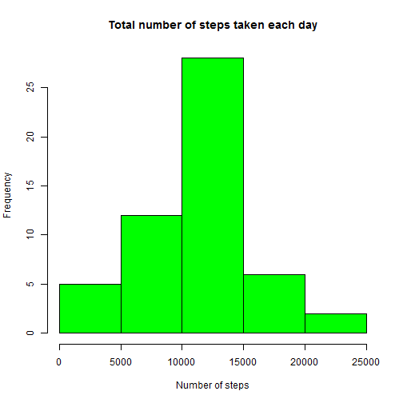
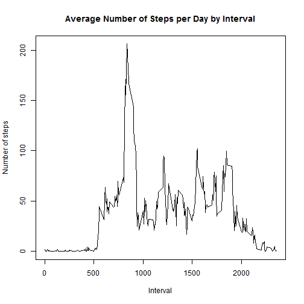
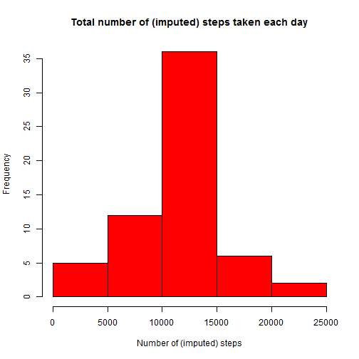
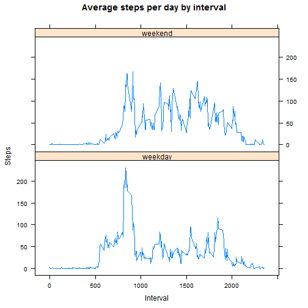

<!-- rmarkdown v1 -->
---
title: "Reproducible Research Course Project 1"
author: "Bahman S."
---

## Introduction
This document uses data from a personal activity monitoring device. This device collects data at 5 minute intervals through out the day. The data consists of two months of data from an anonymous individual collected during the months of October and November, 2012 and include the number of steps taken in 5 minute intervals each day.

## Data 
The data for this assignment can be downloaded from the course web site:

* Dataset: [Activity monitoring data](https://d396qusza40orc.cloudfront.net/repdata%2Fdata%2Factivity.zip) [52K]

The variables included in this dataset are:

* **steps**: Number of steps taking in a 5-minute interval (missing values are coded as NA)

* **date**: The date on which the measurement was taken in YYYY-MM-DD format

* **interval**: Identifier for the 5-minute interval in which measurement was taken

## Downloading and reading the data

Check if zip folder is already downloaded. If not, download it. If the folder is not already unzipped, then unzip the folder.


```r
if (!file.exists("repdata%2Fdata%2Factivity.zip")) {
        download.file("https://d396qusza40orc.cloudfront.net/repdata%2Fdata%2Factivity.zip", "repdata%2Fdata%2Factivity.zip")
}
if (!file.exists("activity.csv")) {unzip("repdata%2Fdata%2Factivity.zip")
}

activity_data <- read.csv("activity.csv")
```
Make another data frame with the missing value rows removed.

```r
activity_data_noNA <- activity_data[complete.cases(activity_data), ]
```
## Total number of steps taken per day
Sum up the number of steps for each day using `tapply`.

```r
steps_per_day <- with(activity_data_noNA, tapply(steps, date, sum))
```
Make a histogram of the total number of steps taken each day.

```r
hist(steps_per_day, main = paste("Total number of steps taken each day"), col = "green", 
     xlab = "Number of steps")
```



Calculate `mean` and `median` of the total number of steps taken each day.

```r
median_steps_per_day <- median(steps_per_day, na.rm = T)
mean_steps_per_day <- mean(steps_per_day, na.rm = T)
```
Report median and mean.

```r
median_steps_per_day
```

```
## [1] 10765
```

```r
mean_steps_per_day
```

```
## [1] 10766.19
```


## Average daily activity pattern
Make a time series plot of the 5-minute interval (x-axis) and the average number of steps taken, averaged across all days (y-axis). This is done using `aggregate` to pass `mean` to steps by interval.

```r
steps_per_interval <- aggregate(steps ~ interval, activity_data_noNA, mean)
plot(steps_per_interval$interval, steps_per_interval$steps, type = "l", xlab = "Interval", ylab = "Number of steps", main = "Average Number of Steps per Day by Interval")
```



Calculate which 5-minute interval, on average across all the days in the dataset, contains the maximum number of steps.

```r
max_index <- which.max(steps_per_interval$steps)
max_interval <- steps_per_interval[max_index, 1]
```
Report the 5-minute interval containing the the maximum number of steps on average.

```r
max_interval
```

```
## [1] 835
```

##Imputing missing values

Calculate and report the total number of missing values in the dataset (i.e. the total number of rows with NAs). Also, copy `activity_data` to a new data frame, `imputed_activity_data`.

```r
NA_count <- sum(!complete.cases(activity_data))
imputed_activity_data <- activity_data
```

My strategy for filling in the missing values is to impute with the mean for the 5-minute interval corresponding to each missing value.

```r
for (i in seq(1, length(activity_data$steps))) {if (is.na(activity_data$steps[i])) { imputed_activity_data$steps[i] <- steps_per_interval[which(steps_per_interval$interval == activity_data$interval[i]), 2]}}
```

Calculate and make a histogram of the total number of steps taken each day. 

```r
imputed_steps_per_day <- with(imputed_activity_data, tapply(steps, date, sum))

hist(imputed_steps_per_day, main = paste("Total number of (imputed) steps taken each day"), col = "red", xlab = "Number of (imputed) steps")
```



Calculate the median and mean total number of steps taken per day. 

```r
median_imputed_steps_per_day <- median(imputed_steps_per_day)
mean_imputed_steps_per_day <- mean(imputed_steps_per_day)
```

Report the median and mean total number of steps taken per day. 

```r
median_imputed_steps_per_day
```

```
## [1] 10766.19
```

```r
mean_imputed_steps_per_day
```

```
## [1] 10766.19
```
Calculate and report the mean and median total number of steps taken per day, as well as the total daily number of steps.

```r
median_diff <- median_imputed_steps_per_day - median_steps_per_day
mean_diff <- mean_imputed_steps_per_day - mean_steps_per_day
```


```r
median_diff
```

```
## [1] 1.188679
```

```r
mean_diff
```

```
## [1] 0
```

As we see, imputing the missing data changes the median, but leaves the mean unchanged. Imputing the missing data generally increases the total daily number of steps, because previously the missing values were just ignored and had no effect on the total daily number of steps.


##Differences in activity patterns between weekdays and weekends


Create a new factor variable in the dataset with two levels - "weekday" and "weekend" indicating whether a given date is a weekday or weekend day.

```r
imputed_activity_data$dayofweek <- as.factor(ifelse(is.element(weekdays(as.Date(imputed_activity_data$date)), c("Monday", "Tuesday", "Wednesday", "Thursday", "Friday")), "weekday", "weekend"))

imputed_steps_per_interval <- aggregate(steps ~ interval + dayofweek, imputed_activity_data, mean)
```

Load `lattice` package and make a panel plot containing a time series plot of the 5-minute interval (x-axis) and the average number of steps taken, averaged across all weekday days or weekend days (y-axis). 


```r
library(lattice)

xyplot(imputed_steps_per_interval$steps ~ imputed_steps_per_interval$interval | imputed_steps_per_interval$dayofweek, main = "Average steps per day by interval", xlab = "Interval", ylab = "Steps", layout = c(1, 2), type = "l")
```




